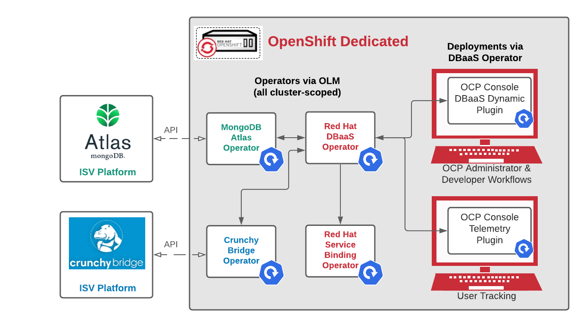
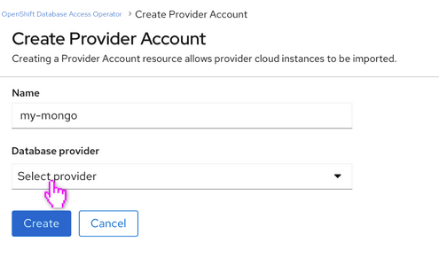
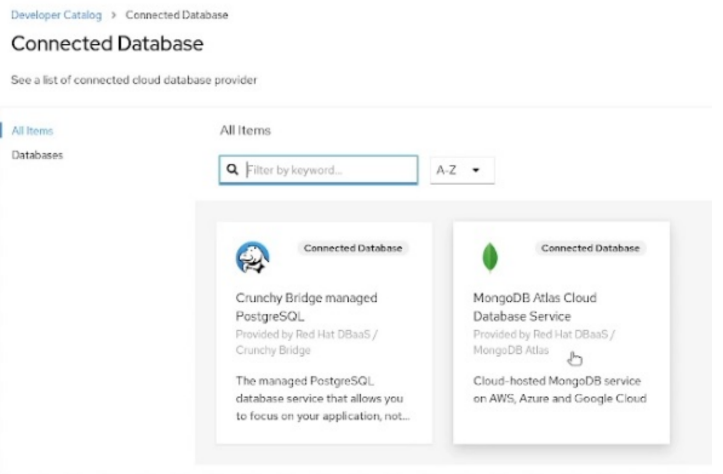
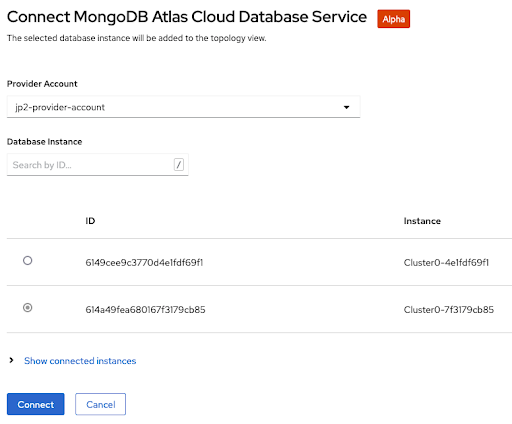
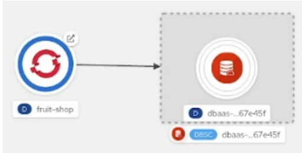

# Red Hat OpenShift Database Access Operator
Red Hat OpenShift Database Access Operator is currently iterating early releases. The intent of these releases is to show how we could
create trail database cluster, scan & import off-cluster cloud database instances hosted by various 3rd party ISV providers & make those instances
available to developers for binding to their applications.

## Architecture Diagram

## Associated Github Repositories
Component |Git Repo	| Description
---  | ------ | ----
DBaaS Console Plugin    |[DBaaS Dynamic Plugin](https://github.com/RHEcosystemAppEng/dbaas-dynamic-plugin) | DBaaS UI console plugin, creation for “Provider Account” and a bindable “Connection” resource.
MongoDB Atlas Operator  |[MongoDB Atlas](https://github.com/mongodb/mongodb-atlas-kubernetes) | Operator responsible for establishing API communications with MongoDB Atlas Database.
Crunchy Bridge Operator |[Crunchy Bridge PostgreSQL](https://github.com/CrunchyData/crunchy-bridge-operator)|Operator responsible for establishing API communications with Crunchy Bridge Managed Postgres Database.
CockroachCloud Operator |[CockroachCloud Operator](https://github.com/cockroachdb/ccapi-k8s-operator/)|Operator responsible for establishing API communications with CockroachCloud Provider Platform.
Service Binding Operator|[Service Binding Operator](https://github.com/redhat-developer/service-binding-operator)|Red Hat operator for binding resources together via Topology View. 
RDS Operator|[RDS Operator](https://github.com/RHEcosystemAppEng/rds-dbaas-operator)| Operator for Amazon RDS building on top of ACK (AWS Controller for Kubernetes).
Observability Operator |[Observability Operator](https://github.com/rhobs/observability-operator)| Operator for installing the monitoring stack and configuring remote write Observatorium.

## Building the Operator
Build the Red Hat OpenShift Database Access Operator image and push it to a public registry, such as quay.io:

Reqs:
 - go v1.17
 - operator-sdk v1.20.1

**if you are using podman instead of docker set CONTAINER_ENGINE as podman** `export CONTAINER_ENGINE=podman`
- `make build`
- `make docker-build docker-push IMG=quay.io/<YOUR_USERNAME_IN_QUAY>/dbaas-operator:<version>`

## Running the Operator

**NOTE**: The DBaaS console UI portion of the workflow described below will *only* work if your operator is installed via OLM and using version OpenShift Container Platform (OCP) version 4.9 or higher.
If you run locally or via direct deploy (first 2
options), you can create a DBaaSInventory & will receive a DBaaSConnection, but will not see DBaaS console UI and bindable in Topology view.

**Run as a local instance**:
- `make install run INSTALL_NAMESPACE=<your_target_namespace> ENABLE_WEBHOOKS=false`
- Continue below by following the [Using the Operator](#using-the-operator) section
- When finished, remove created resources via:
  - `make clean-namespace`

**Deploy & run on a cluster:**
- `oc project <your_target_namespace>`
- `make deploy`
- Continue below by following the [Using the Operator](#using-the-operator) section
- When finished, clean up & remove deployment via:
  - `make clean-namespace undeploy`

**Deploy via OLM on cluster:**
- **Make sure to edit `Makefile` and replace `QUAY_ORG` in the `IMAGE_TAG_BASE` with your own Quay.io Org!**
- **Next `make release-build`**
- **Next edit the [catalog-source.yaml](config/samples/catalog-source.yaml) template to indicate your new Quay.io org image**
- `make release-push catalog-update`
- Make visibility of the repositories (`dbaas-operator`, `dbaas-operator-bundle`, and `dbaas-operator-catalog`) public in your Quay.io account
- Access to an OpenShift and navigate in the web console to the **Operators → OperatorHub** page.
- Scroll or type a keyword into the Filter by keyword box **OpenShift Database Access Operator** click Install.
  The RHODA operator is cluster scope and the default installed namespace is **openshift-dbaas-operator**. 
- On successful installation of RHODA operator, will automatically install all its dependencies and the operator logs shows: *DBaaS platform stack installation complete*.
- Continue below by following the [Using the Operator](#using-the-operator) section
- If you wish to uninstall operator and dependencies from your cluster: delete dbaas-platform(DBaaSPlatform) CR manually wait for the operator to uninstall its dependencies and then uninstall RHODA operators by going →**Operators → Installed Operators → Actions → Uninstall Operator**.
  Then delete the catalog source.

## Configuration Observability Operator

See the document :  [Observability Operator configuration](docs/observability-operator-config.md)

## Using the Operator

**Prerequisites:**
- An instance of OpenShift Container Platform (OCP) 4.9 or higher
- A database instance created using either the MongoDB Atlas or Crunchy Data Bridge cloud database provider.

**Creating a DBaaSInventory:**
- Click Operators → Installed Operators.
- Set the Project dropdown to the openshift-dbaas-operator project.
- Click the name of the OpenShift Database Access Operator to view the details page.
- Under Provided APIs, on the Provider Account tile, click Create instance to create a new provider account instance.
- Refresh the page if you are not seeing the DBaaS Console UI, this required only once to reload the plugin.
- On the Create Provider Account page, specify a name for the new Provider Account resource.
  
- Select your cloud database provider from the drop-down menu and provide the credentials for that provider.
- Click on the Create button to create the Provider Account resource and fetch the available database instances.
- If fetching is successful, then you can click on the View Provider Accounts button to display the exposed database instances that developers can import.
- For more understanding see the demo: [IT Operations preview demo of Red Hat OpenShift Database Access](https://www.youtube.com/watch?v=QmF5da2LvnU&t=0s&ab_channel=OpenShift)  

**Creating a DBaaSConnection:**
- Change into the Developer perspective. Click +Add.
- Select/Create the project to the application that you want to add the database to. Sample Quarkus application deployment for [mongo-db](config/samples/quarkus-mongodb-sample-app.yaml) & [crunchy-bridge](config/samples/quarkus-crunchydata-sample-app.yaml)
- From **Developer Catalog** Click on the **Database** category or select the **Connected Database**
  
- Select the database provider and click Connect.  
  
- Select the database provider and click Connect.  
  
- Upon successful connection, you are taken to the Topology page.
- Click and drag the arrow from the application to the new database instance to create a binding connector.
  
- For more understanding see the demo: [Developer preview demo of Red Hat OpenShift Database Access](https://www.youtube.com/watch?v=wEcqQziu17o&ab_channel=OpenShift)  
 
## Contributing

- Fork Red Hat OpenShift Database Access Operator repository
  - https://github.com/RHEcosystemAppEng/dbaas-operator
- Check out code from your new fork
  - `git clone git@github.com:<your-user-name>/dbaas-operator.git`
  - `cd dbaas-operator`
- Add upstream as git remote entry
  - `git remote add upstream git@github.com:RHEcosystemAppEng/dbaas-operator.git`
- create feature branches within your fork to complete your work
- raise PR's from your feature branch targeting upstream main branch
- add `jeremyary` (and others as needed) as reviewer
