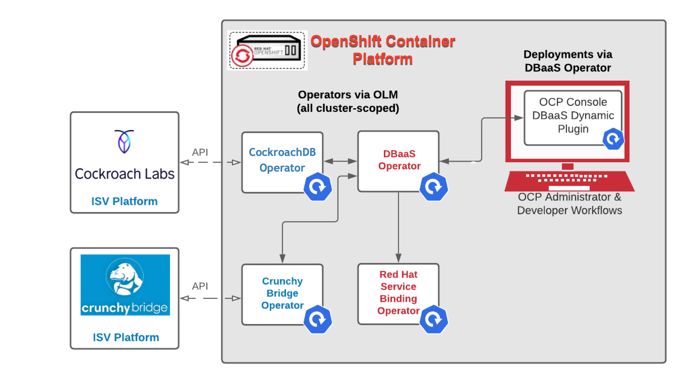
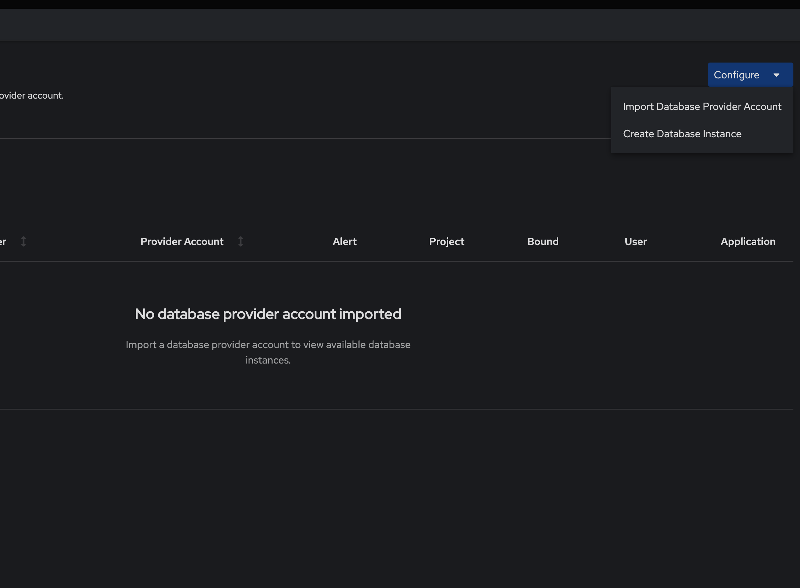
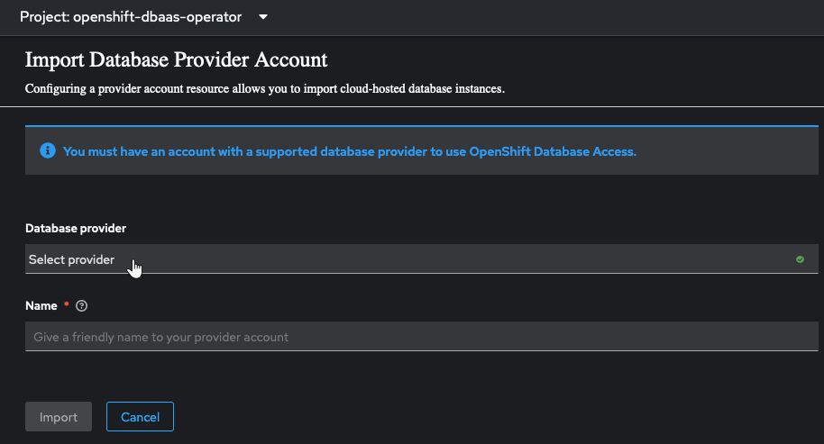
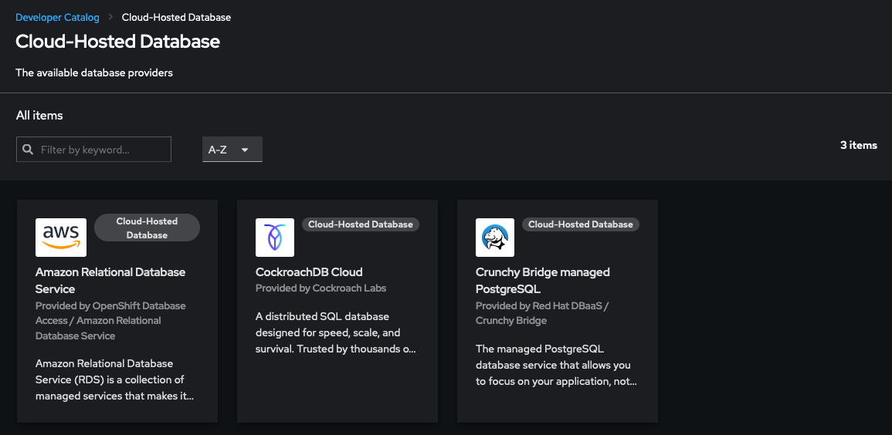
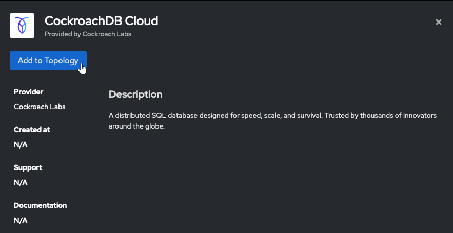
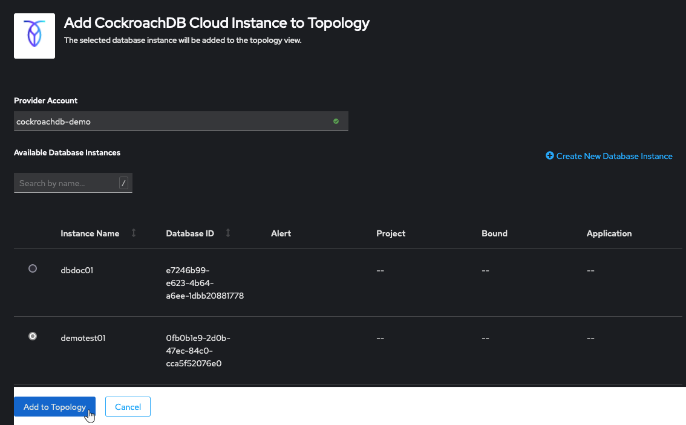
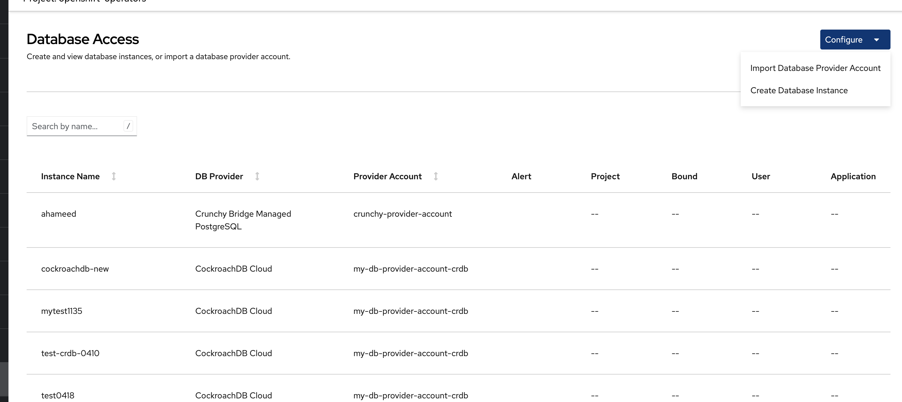
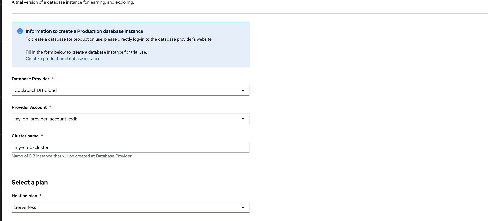
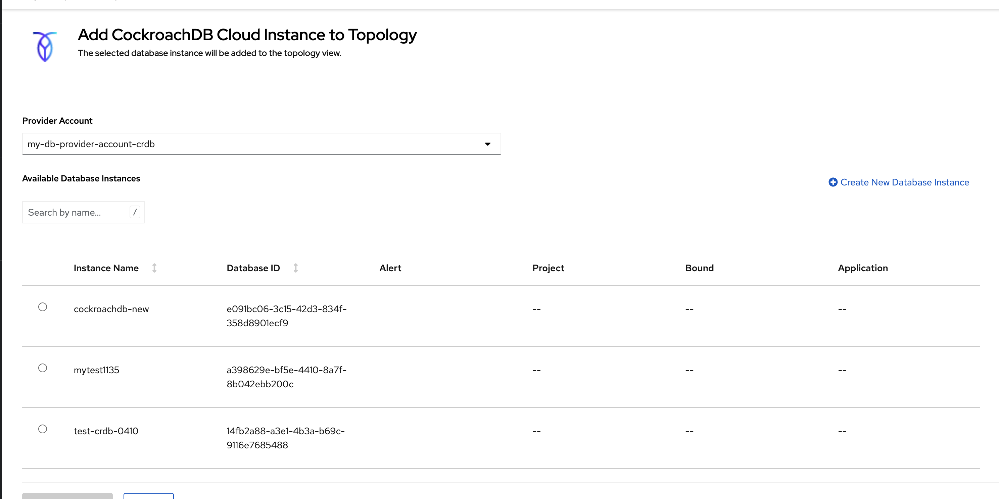

# OpenShift Database Access Operator
OpenShift Database Access Operator (a.k.a. DBaaS Operator) is currently iterating early releases. The intent of these releases is to show how we could
create trail database cluster, scan & import off-cluster cloud database instances hosted by various 3rd party ISV providers & make those instances
available to developers for binding to their applications.

## Architecture Diagram

## Documentation

- [Quick Start Guide](docs/quick-start-guide/main.adoc)
- [Reference Guide](docs/reference-guide/main.adoc)
- [Discussions](https://github.com/RHEcosystemAppEng/dbaas-operator/discussions)

## Associated Github Repositories
Component |Git Repo	| Description
---  | ------ | ----
DBaaS Console Plugin    |[DBaaS Dynamic Plugin](https://github.com/RHEcosystemAppEng/dbaas-dynamic-plugin) | DBaaS UI console plugin, creation for “Provider Account” and a bindable “Connection” resource.
Crunchy Bridge Operator |[Crunchy Bridge PostgreSQL](https://github.com/CrunchyData/crunchy-bridge-operator)|Operator responsible for establishing API communications with Crunchy Bridge Managed Postgres Database.
CockroachCloud Operator |[CockroachCloud Operator](https://github.com/cockroachdb/ccapi-k8s-operator/)|Operator responsible for establishing API communications with CockroachCloud Provider Platform.
Service Binding Operator|[Service Binding Operator](https://github.com/redhat-developer/service-binding-operator)|Red Hat operator for binding resources together via Topology View. 
RDS Operator|[RDS Operator](https://github.com/RHEcosystemAppEng/rds-dbaas-operator)| Operator for Amazon RDS building on top of ACK (AWS Controller for Kubernetes).
Observability Operator |[Observability Operator](https://github.com/rhobs/observability-operator)| Operator for installing the monitoring stack and configuring remote write Observatorium.

## Building the Operator
Requires:
 - go v1.18
 - operator-sdk v1.22.2

Build the OpenShift Database Access Operator image and its bundle and catalog images and push them to a public registry, such as quay.io:

- `ORG=<YOUR_QUAY_USER> VERSION=<version> make release-build release-push`

**If you are using podman instead of docker:** 
- `CONTAINER_ENGINE=podman ORG=<YOUR_QUAY_USER> VERSION=<version> make release-build release-push`

You can also build and push the image to a public registry other than quay.io:
- `REGISTRY=<YOUR_REGISTRY> VERSION=<version> make release-build release-push`

- Make visibility of the repositories (`dbaas-operator`, `dbaas-operator-bundle`, and `dbaas-operator-catalog`) public in your Quay.io account
- `ORG=<YOUR_QUAY_USER> VERSION=<version> make catalog-update`
    - Note: We already pre-build the dbaas-operator images, which can be deployed to the cluster. They can be found here:
      https://quay.io/repository/ecosystem-appeng/dbaas-operator-dev-catalog?tab=tags
    - You can also find the exact commit you want to deploy based on the commit sha.

## Running the Operator (requires OCP 4.10 or higher)
**NOTE**: The DBaaS console UI portion of the workflow described below will *only* work if your operator is installed via OLM and using version OpenShift Container Platform (OCP) version 4.10 or higher.
If you run locally or via direct deploy (no longer recommended), you can create a DBaaSInventory. DBaaSConnection CRs created directly in command line can appear in the topology view in the OpenShift Console.

**[Install](https://github.com/RHEcosystemAppEng/dbaas-operator/discussions/374) the Operator From OperatorHub:**

- Access to an OpenShift and navigate in the web console to the **Operators → OperatorHub** page.
- Scroll or type a keyword into the Filter by keyword box **OpenShift Database Access Operator** click Install.
  The DBaaS operator is cluster scope and the default installed namespace is **openshift-dbaas-operator**. 
- On successful installation of DBaaS operator, will automatically install all its dependencies and the operator logs shows: *DBaaS platform stack installation complete*.
- Continue below by following the [Using the Operator](#using-the-operator) section
- If you wish to uninstall operator click *Operators →Installed Operators* then  **OpenShift Database Access Operator** click *Uninstall Operator* from *Actions* 

## Using the Operator
**Prerequisites:**
- Either OpenShift Container Platform or Origin Kubernetes Distribution (OKD) 4.10 or higher.
- [Installation](https://github.com/RHEcosystemAppEng/dbaas-operator/blob/main/docs/quick-start-guide/main.adoc#installing-the-openshift-database-access-operator) of the OpenShift Database Access operator.
- A service account with either the Crunchy Data Bridge, or CockroachDB, or Amazon RDS cloud-hosted database provider.

**Creating a DBaaSInventory:**
1. From the OpenShift console home page, in the **Administrator** perspective, click **Data Services(the last menu option)**,  then click **Database Access**.
2. Set the **Project** to **openshift-dbaas-operator**.
   
3. Click the **Configure** button to view the dropdown links.
4. Click the **Import Database Provider Account** link to create a new provider account.
   
   **NOTE:** Refresh the page if you are not seeing the DBaaS Console UI, this requires a one-time only plugin reload.
5. On the Import Provider Account page, select a **Database provider**, provide the credentials for your choosen cloud-hosted database provider, and specify a name for the new provider account resource.
   

6. Click the **Import** button to create the provider account resource, and fetch the available database instances.
7. If fetching is successful, then you see can the exposed database instances that developers can import, or you can click the **View Provider Accounts** button to return to the provider account's **DBaaSInventorys** page. Click the link to view an [IT Operations preview demo of OpenShift Database Access](https://www.youtube.com/watch?v=QmF5da2LvnU&t=0s&ab_channel=OpenShift). 

**Creating a DBaaSConnection:**
1. From the OpenShift console home page, switch to the **Developer** perspective.
2. Click **+Add**.
3. Select or create a project for your application where you want to add a database to.
   Here is sample application deployment for [Service Bindings](https://github.com/RHEcosystemAppEng/dbaas-operator/discussions/365).
4. Click the **Cloud-hosted Database** category.
   
5. Select the cloud-hosted database provider tile, and click **Add to Topology**.  
   
6. Select the database instance name, and click **Add to Topology**.  
   
7. Upon a successful connection, you are taken to the Topology page.
8. Click and drag the arrow from the application to the new database instance to create a binding connector.
   
   Click the link to view a [Developer preview demo of OpenShift Database Access](https://www.youtube.com/watch?v=wEcqQziu17o&ab_channel=OpenShift).

**Creating a DBaaSInstance:**

Users can provision a new database cluster (or instance) by creating a DBaaSInstance custom resource through the Administrator or Developer perspective with the following steps.

**Administrator Perspective**

1. Click the **Database Services-->Database Access** to view the DBaaS Dashboard page.
2. From the top corner click **Configure** then Create **Database Instance** link.
  
3. Select the desired **Database Provider** type and **Provider account**.
   
4. Choose the name, cloud provider, other configuration options.
5. Click the **Create** button to create the DBaaSInstance.

**Developer Perspective**

1. From the OpenShift console home page, switch to the **Developer** perspective.
2. Click **+Add**.
3. Click the **Cloud-hosted Database** category.
   
4. Select the cloud-hosted database provider tile, and click **Add to Topology**.  
   
5. Click on the **Creat New Database Instance**
   
6. This will redirect to **Create Database Instance** Page
7. Choose the name, cloud provider, other configuration options.
8. Click the **Create** button to create the DBaaSInstance.

## [API Reference](docs/api/markdown/ref.md)

## Contributing

- Fork OpenShift Database Access Operator repository
  - https://github.com/RHEcosystemAppEng/dbaas-operator
- Check out code from your new fork
  - `git clone git@github.com:<your-user-name>/dbaas-operator.git`
  - `cd dbaas-operator`
- Add upstream as git remote entry
  - `git remote add upstream git@github.com:RHEcosystemAppEng/dbaas-operator.git`
- create feature branches within your fork to complete your work
- raise PR's from your feature branch targeting upstream main branch

## Appendix

### Go Installation
* If the go installation version on your dev machine is different from the one required e.g. go1.18, visit the [go.dev/dl](go.dev/dl)
* Download the installer package for the needed version e.g. go1.18.x and follow official go installation instructions
* Verify the go installation is successful

### Alternatively - Run as a local instance
- `make install run INSTALL_NAMESPACE=<your_target_namespace> ENABLE_WEBHOOKS=false`
- Continue below by following the [Using the Operator](#using-the-operator) section
- When finished, remove created resources via:
  - `make clean-namespace`

### Deploy & run on a cluster
- `oc project <your_target_namespace>`
- `make deploy`
- Continue below by following the [Using the Operator](#using-the-operator) section
- When finished, clean up & remove deployment via:
  - `make clean-namespace undeploy`
