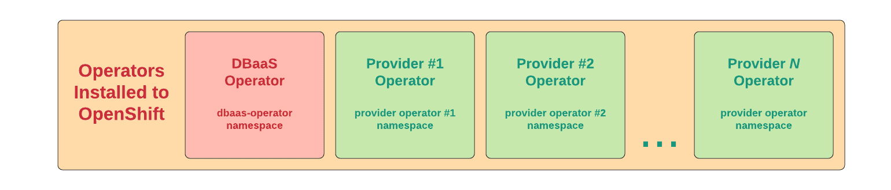
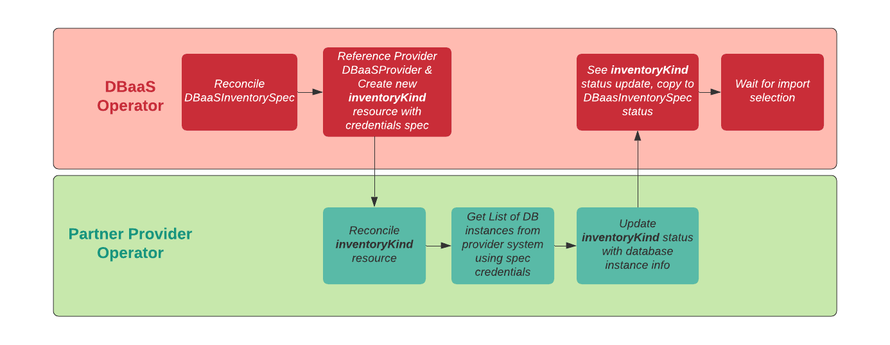

# DBaaS Partner Provider Guide


## Goals:
- Allow database partner provider operators to register themselves with the Database-as-a-Service(DBaaS) operator using DBaaSProvider custom resource (CR).
- Query the provider's cloud-hosted database services using API calls to determine a list of all databases available for the given user.
- Allow applications to retrieve all information from the provider's database cloud-hosting system required for connecting to database instances such as connection string and credentials.
- Allows a Service Administrator or a Developer to provision trial or dedicated database clusters or instances by provider operator.

## Prerequisites:
This section specifies steps and/or conditions necessary for installation & initial setup for collaboration between the DBaaS & Partner Provider operator:

- DBaaS operator installed on OpenShift.
- Partner provider operators also installed on OpenShift.

  


## Register the Provider Operator with DBaaS Operator:

- When the provider operator starts, it should create a **cluster-scoped** DBaaSProvider CR on the OpenShift cluster which will inform the DBaaS operator how to work with their operator based on the information specified in the DBaaSProvider registration CR.
  The format should resemble as follows:

cockroachdb-cloud-registration example
```yaml

apiVersion: dbaas.redhat.com/v1beta1
kind: DBaaSProvider
metadata:
  labels:
    related-to: dbaas-operator
    type: dbaas-provider-registration
  name: cockroachdb-cloud-registration
spec:
  allowsFreeTrial: true
  externalProvisionURL: 'https://www.cockroachlabs.com/docs/cockroachcloud/quickstart.html'
  instanceKind: CrdbDBaaSInstance
  credentialFields:
    - displayName: API Secret Key
      helpText: >-
        The API Secret Key is a generated token associated with your CockroachDB
        Cloud Service Account.
      key: apiSecretKey
      required: true
      type: maskedstring
  inventoryKind: CrdbDBaaSInventory
  provider:
    displayDescription: >-
      A distributed SQL database designed for speed, scale, and survival.
      Trusted by thousands of innovators around the globe.
    displayName: CockroachDB Cloud
    icon:
      base64data: >-
        iVBORw0KGgoAAAANSUhEUgAAACAAAAAgCAYAAABzenr0AAAAGXRFWHRTb2Z0d2FyZQBBZG9iZSBJbWFnZVJlYWR5ccllPAAAA/xJREFUeNq0V9uLE1cY/85k08wk2TWyf8AGH30oI8kigrLxgsULbqC1PrR0Z3rRQh928yD2ySUKgvhg9lFFZ1ZhZR+kkdaCgiUrBSm7YYc+9KmF2AfBBzF46V6SOcfvTM7kvu5kM/1gcgIz53y/7/fdzkegSQK77y4roKhhJkMEFAgzfPgKcjnCFAv/LyhMzt8pRizoIkezq2o1wtKVQTpWGWRqJcpiuML6IAW+8qcaZda/Q8O73D0DrUeQEv6o7QcTgBguKf4QINNnkrZFw2TmxhPJ5O9PnlnXUNlkhTIVNhMGpbazGxLcPR+v/HGq1L5n/+jfqsKQGZDHkZW0QmSwIwCotFDZRvmaciyMOk8eGbiPq/X7l9EOpkbKL+PPYsOlrgC8yNeJtVhQCk7ZYZh2aUWFgNRnqwrL/XxJLvdyntQrgFvFEFcw0uXVSK/KtwRgIrFioB81hz4KGSAs47hWAu3Y+VXjfwXwefLVFANWU26Dbv4ayM3NBXOoXBcO1T65vDLVy5meY+B48rkqQ2iZp6YMH2WuFwdyze/Hz65OVcNw1Uk1he367Yew5SsDFJhRyyJWaFfO5f4VmTNRcL4JMMNXFxxI/oO013KcEjqzYYpLbEbwqu67/VbzDQAlbLJRR1j5Aw61GmBg0hcAe0b/Ul3rPUi86WR1z703at8A0OJ0S79ggQ0tIzaZbHUJpPsGgME3VgMCZo1lkj6dqHb4d/zsmoZ1wVVoCgBjfjDAmxDYYGclIE70EyIZ3+2ldRCffb/OlRuiPuToAGRFTKQ2O3/Aa7o8WhrhDSSDlZB3Ro0FwNCO2LA2jH2AirRjYD48pziVce/c2/7T8OPRYkrQX+9es0VFR8tqFCMI9LshyrL54IKsN5ir7Uk8ep3qOw3RDS0t+tqipDenHCov/HQ1pLelZMmPNCyLwOtIJxpg2QYA0lGcCKtfbMpbBvDnYsJquhG1tuXHgbz7f/5WMN9lu7OneHjI6tcFjgWHk8+8FiMYu/nOk/WeAGDqFYQbUl4BYNCkRBEp9A0AFS8IIBOeezyFCREHC34AyLuBmE6+iG/2/aGZ/+JuACKQfN8Ani7uLKFys/axNL0pYBumxWo+/XSw1DcA5yMmzQoA2hfJNxvGwpGLKylMSU3QP+vbfeDx0o5CnQUmGd8mKh1peeLcaqxeFdH6J19FC74BENbzGl9GIHEJm1GXVmyg1XHMgDKykPH9UsrlVPKVGmKhZT4ZUQXM9W1Mc2a/IWrizMfHM+dC+vBHxfJuWA8yv7TdQiZ0dw5oKrvunKD3onxLg4lZlE1CiN5S5TjtOCf8clE2ez2v59nQlW8O2mo1zIwqDqm46tgPrK2c816AAQCBW4SEJD8W2QAAAABJRU5ErkJggg==
      mediatype: image/png
    name: Cockroach Labs
  externalProvisionDescription: Follow the guide to start a free CockroachDB Serverless (beta) cluster.
  connectionKind: CrdbDBaaSConnection
  provisioningParameters:
    machineType:
      conditionalData:
        - defaultValue: m5.large
          dependencies:
            - field: plan
              value: DEDICATED
            - field: cloudProvider
              value: AWS
          options:
            - displayValue: '2 vCPU, 8 GiB RAM'
              value: m5.large
            - displayValue: '4 vCPU, 16 GiB RAM'
              value: m5.xlarge
            - displayValue: '8 vCPU, 32 GiB RAM'
              value: m5.2xlarge
            - displayValue: '16 vCPU, 64 GiB RAM'
              value: m5.4xlarge
            - displayValue: '32 vCPU, 128 GiB RAM'
              value: m5.8xlarge
        - defaultValue: n1-standard-2
          dependencies:
            - field: plan
              value: DEDICATED
            - field: cloudProvider
              value: GCP
          options:
            - displayValue: '2 vCPU, 7.5 GiB RAM'
              value: n1-standard-2
            - displayValue: '4 vCPU, 15 GiB RAM'
              value: n1-standard-4
            - displayValue: '8 vCPU, 30 GiB RAM'
              value: n1-standard-8
            - displayValue: '16 vCPU, 60 GiB RAM'
              value: n1-standard-16
            - displayValue: '32 vCPU, 120 GiB RAM'
              value: n1-standard-32
      displayName: Compute
    serverlessLocationLabel:
      displayName: Select regions
      helpText: >-
        Select the geographical region where you want the database instance to
        run.
    storageGib:
      conditionalData:
        - defaultValue: '15'
          dependencies:
            - field: plan
              value: DEDICATED
            - field: cloudProvider
              value: AWS
          options:
            - displayValue: 15 GiB
              value: '15'
            - displayValue: 35 GiB
              value: '35'
            - displayValue: 75 GiB
              value: '75'
            - displayValue: 150 GiB
              value: '150'
            - displayValue: 300 GiB
              value: '300'
            - displayValue: 600 GiB
              value: '600'
        - defaultValue: '15'
          dependencies:
            - field: plan
              value: DEDICATED
            - field: cloudProvider
              value: GCP
          options:
            - displayValue: 15 GiB
              value: '15'
            - displayValue: 35 GiB
              value: '35'
            - displayValue: 75 GiB
              value: '75'
            - displayValue: 150 GiB
              value: '150'
            - displayValue: 300 GiB
              value: '300'
            - displayValue: 600 GiB
              value: '600'
      displayName: Storage
    cloudProvider:
      conditionalData:
        - defaultValue: GCP
          dependencies:
            - field: plan
              value: FREETRIAL
          options:
            - displayValue: Google Cloud Platform
              value: GCP
        - defaultValue: AWS
          dependencies:
            - field: plan
              value: SERVERLESS
          options:
            - displayValue: Amazon Web Services
              value: AWS
            - displayValue: Google Cloud Platform
              value: GCP
        - defaultValue: AWS
          dependencies:
            - field: plan
              value: DEDICATED
          options:
            - displayValue: Amazon Web Services
              value: AWS
            - displayValue: Google Cloud Platform
              value: GCP
      displayName: Cloud provider
    plan:
      conditionalData:
        - defaultValue: SERVERLESS
          options:
            - displayValue: Free trial
              value: FREETRIAL
            - displayValue: Serverless
              value: SERVERLESS
            - displayValue: Dedicated
              value: DEDICATED
      displayName: Hosting plan
    planLabel:
      displayName: Select a plan
    name:
      displayName: Cluster name
    hardwareLabel:
      displayName: Hardware per node
      helpText: Select the compute and storage requirements for this database instance.
    dedicatedLocationLabel:
      displayName: Select regions & nodes
      helpText: >-
        Select the geographical region where you want the database instance to
        run, and set the number of nodes you want running in this dedicated
        cluster.
    nodes:
      displayName: ''
    spendLimitLabel:
      displayName: Spend limit
      helpText: >-
        Set a spending limit on resources for this database instance.This value
        is the maximum amount, in credits, that you can be charged for a month
        of usage. Once the spending limit is met, cluster performance could be
        reduced or become unavailable. A spending limit value of zero means the
        Serverless hosting plan is free, but limits resources to 250 million
        request units (RU), and 5 GB of storage. For more information, see
        CockroachDB’s Serverless [pricing
        page](https://www.cockroachlabs.com/docs/cockroachcloud/learn-about-pricing#choosing-a-spend-limit).
    spendLimit:
      conditionalData:
        - defaultValue: '0'
          dependencies:
            - field: plan
              value: SERVERLESS
      displayName: Spend limit
    regions:
      displayName: ''
  groupVersion: dbaas.redhat.com/v1beta1
```

- The DBaasProvider CR for example includes:
  - The **name** of the provider to be used when indicating Service Binding origin for example, “Cockroach Labs”.
  - The **displayName** indicates the name of the provider/platform for displaying in the UX, for example, on developer catalog tiles for example “CockroachDB Cloud”.
  - The **displayDescription** indicates the description for the provider/platform for displaying in the UX, for example, on developer catalog tiles.
  - The **icon** contains base64 string representation & mediatype of the provider’s icon for displaying in the UX, for example, on developer catalog tiles.
    - Likely equivalent the values used by providers in their CSV
  - **inventoryKind**
    - The **name** of the provider’s Inventory resource, for example CrdbDBaaSInventory.
    - The Kind of CRD for returning inventory string value.
    - Note the group/version of ‘**dbaas.redhat.com/v1beta1**’ required to allow our operator to work with the resource without requiring dependency import or open-ended permissions.
  - **connectionKind**
    - The **name** of the provider’s Connection resource, for example CrdbDBaaSConnection.
    - The Kind of CRD for connecting to an instance  string value.
    - Again, note the group/version of ‘**dbaas.redhat.com/v1beta1**’.
  - **instanceKind**:
    - The **name** of the provider’s instance resource, for example CrdbDBaaSInstance.
    - The Kind of CRD for connecting to an instance  string value.
    - Again, note the group/version of ‘**dbaas.redhat.com/v1beta1**’.
  - **credentialFields**
    - Describes the format of the fields that will be found in the CredentialsRef Secret specified in the DBaaSInventorySpec defined below.
    - Can be used by the UI to generate a simple form - for each input string, indicates the name, type, and if it’s required.
    - Can be extended with more properties in the future if necessary.

  - **provisioningParameters**
    - Describes the format of the fields that a provider must provide for creating a database cluster. For instance, the provider must add which cloud provider they support, the region of the provider's cloud service, and the plan they offer, as specified in the CR.

     
For more information about each field defined in the DBaaSProvider CR, see the [DBaaS API documentation](https://github.com/RHEcosystemAppEng/dbaas-operator/blob/main/docs/api/markdown/ref.md#dbaasprovider) 
## Discovery of Database Instances via DBaasInventory



Once the DBaaS operator has reconciled a provider’s DBaaSProvider, collaboration can now occur between the operators using creating/updating the specified
*inventoryKind*  resource type. The first area of coordination between the operators occurs when discovering all of a user’s available database instances.
The actual instances discovery is done using the corresponding provider operator, and to that end, the DBaaS Operator will create a resource of type *inventoryKind* for the provider operator to reconcile. The *inventoryKind* resource will have a single spec field, *CredentialsRef*, which points to an on-cluster Secret resource containing all the user credentials fields required by the provider operator to query their platform as defined in their DBaaSProvider CR.
The **DBaaSInventorySpec** seen below represents the field as copied into the newly created resource of type *inventoryKind -* the secret reference being the only information within the spec.

```go
// DBaaSOperatorInventorySpec defines the desired state of a DBaaSInventory object.
type DBaaSOperatorInventorySpec struct {
  
	// A reference to a DBaaSProvider custom resource (CR).
	ProviderRef NamespacedName `json:"providerRef"`

	// The properties that will be copied into the provider’s inventory.
	DBaaSInventorySpec `json:",inline"`

	// The policy for this inventory.
	Policy *DBaaSInventoryPolicy `json:"policy,omitempty"`
    
}
  // DBaaSInventorySpec defines the Inventory Spec to be used by provider operators
  type DBaaSInventorySpec struct {
  // The secret containing the provider-specific connection credentials to use with the provider's API endpoint.
  // The format specifies the secret in the provider’s operator for its DBaaSProvider custom resource (CR), such as the CredentialFields key.
  // The secret must exist within the same namespace as the inventory.
  CredentialsRef *LocalObjectReference `json:"credentialsRef"`
}
  // LocalObjectReference contains enough information to locate the referenced object inside the same namespace.
  type LocalObjectReference struct {
  // Name of the referent.
  Name string `json:"name" protobuf:"bytes,1,opt,name=name"`
}

```
## Instance Listing Response:
- Once a resource of type *inventoryKind* has been created, the DBaaS operator will simply await an *inventoryKind* resource status update from the provider operator in response.
- Once the provider operator has queried their system by means of their choosing, the resultant list of instances should be added to the *inventoryKind* resource status, keeping the following in mind:
  - The *inventoryKind* spec will not having anything other than the **DBaaSInventorySpec** added to it.
  - The status of the *inventoryKind* resource will reflect the available inventory using the following shared **DBaaSInventoryStatus** type so that the DBaaS operator can copy the provider’s result into our own **DBaaSInventorySpec** that initiated the listing request:
```go
// DBaaSInventoryStatus defines the inventory status that the provider's operator uses.
  type DBaaSInventoryStatus struct {
  Conditions []metav1.Condition `json:"conditions,omitempty"`

  // A list of database services returned from querying the database provider.
  DatabaseServices []DatabaseService `json:"databaseServices,omitempty"`
}
  
// DatabaseService defines the information of a database service.
type DatabaseService struct {
	// A provider-specific identifier for the database service.
	// It can contain one or more pieces of information used by the provider's operator to identify the database service.
	ServiceID string `json:"serviceID"`

	// The name of the database service.
	ServiceName string `json:"serviceName,omitempty"`

	// The type of the database service.
	ServiceType *DatabaseServiceType `json:"serviceType,omitempty"`

	// Any other provider-specific information related to this service.
	ServiceInfo map[string]string `json:"serviceInfo,omitempty"`
}
```
- Once the instance list has been provided, partner providers may choose to monitor and update as needed to reflect the status of their platform.
- **Note**: The provider operator’s response should list all database instances that are available for the provider administrator’s credentials.
  - If the provider’s entity hierarchy uses multiple organizations, we anticipate that the provider operator will restructure the status response presented so that the organization is additional information
    about the instance rather than a hierarchical separation partitioning instances available to the user.
- The information returned about each instance is designed to be as generic as possible, to suit any DBaaS offering.  It consists of the service ID, name and type.  Any additional provider-specific information may be returned in the *ServiceInfo map* property.
- The status also contains a list of *Conditions*.  One condition type is currently defined, which informs the user if the information returned in the Status is synced with the database service, or if an error occurred last time it was polled:

|**Type**|**Status**|**Reason**|
| :-: | :-: | :-: |
|SpecSynced|True|SyncOK|
|SpecSynced|False|InputError|
|SpecSynced|False|BackendError|
|SpecSynced|False|EndpointUnreachable|
|SpecSynced|False|AuthenticationError|

- **Note**: There is a limit on how many records can be returned. By default, the *etcd* limits the maximum data entry size to 1.5MB.  In the future, another Condition can be added to indicate that not all the requested records can be returned.  In that case, the administrator might provide credentials with a narrower scope, and/or we can add support for provider-specific filters.

Example :

```yaml
spec:
  credentialsRef:
    name: dbaas-vendor-credentials-1681143707088
  providerRef:
    name: cockroachdb-cloud-registration
status:
  conditions:
    - lastTransitionTime: '2023-04-10T16:21:47Z'
      message: SyncOK
      reason: SyncOK
      status: 'True'
      type: SpecSynced
  databaseServices:
    - serviceID: 21935e55-abd6-4015-8dc5-9c86299997f9
      serviceInfo:
        numOfRegions: '1'
        cockroachVersion: v22.2.7
        cloudProvider: AWS
        regions.1.sqlDns: free-tier14.aws-us-east-1.cockroachlabs.cloud
        creatorId: 7a18ef90-7cf5-4378-97a4-ad54b9f0c907
        plan: SERVERLESS
        createAt: '2023-04-03 23:59:37.125682 +0000 UTC'
        state: CREATED
        regions.1.name: us-east-1
        operationStatus: CLUSTER_STATUS_UNSPECIFIED
        config.serverless.routingId: user1-spring-9987
        updateAt: '2023-04-04 00:02:21.364169 +0000 UTC'
      serviceName: user1-spring
    - serviceID: 664341db-c0a5-4d00-9d6c-a034fc08cab4
      serviceInfo:
        numOfRegions: '1'
        cockroachVersion: v22.2.7
        cloudProvider: AWS
        regions.1.sqlDns: free-tier4.aws-us-west-2.cockroachlabs.cloud
        creatorId: 39ff4ef0-100b-41ac-ad09-21cbafaa7a2e
        plan: SERVERLESS
        createAt: '2022-12-08 05:50:47.552563 +0000 UTC'
        state: CREATED
        regions.1.name: us-west-2
        operationStatus: CLUSTER_STATUS_UNSPECIFIED
        config.serverless.routingId: vedadashan-4413
        updateAt: '2022-12-08 05:50:48.228278 +0000 UTC'
      serviceName: vedadashan
```

## Connect to a Database Instance in Your Application:
At this point, the DBaaS Operator can now present a list of available instances to administrator & developer users within their respective UX workflows. From here, the DBaaS operator will await developer user creation of a DBaaSConnection using the UX workflow that indicates a connection that should now be imported. After this is received, the DBaaS Operator will create a *connectionKind* resource as defined in the provider’s custom resource for the provider operator to reconcile for each selected instance. The spec of this *connectionKind* resource will have two fields:
```go
// DBaaSConnectionSpec defines the desired state of a DBaaSConnection object.
type DBaaSConnectionSpec struct {
  
    // A reference to the relevant DBaaSInventory custom resource (CR).
    InventoryRef NamespacedName `json:"inventoryRef"`
    
    // The ID of the database service to connect to, as seen in the status of the referenced DBaaSInventory.
    DatabaseServiceID string `json:"databaseServiceID,omitempty"`
    
    // A reference to the database service CR used, if the DatabaseServiceID is not specified.
    DatabaseServiceRef *NamespacedName `json:"databaseServiceRef,omitempty"`
    
    // The type of the database service to connect to, as seen in the status of the referenced DBaaSInventory.
    DatabaseServiceType *DatabaseServiceType `json:"databaseServiceType,omitempty"`
}
```


Upon reconciliation, the provider operator should use the provided *InventoryRef* to identify what instance has been requested and provide any further information required for connectivity using the *connectionKind* resource’s status:

```go

// DBaaSConnectionStatus defines the observed state of a DBaaSConnection object.
type DBaaSConnectionStatus struct {
Conditions []metav1.Condition `json:"conditions,omitempty"`

	// The secret holding account credentials for accessing the database instance.
	CredentialsRef *corev1.LocalObjectReference `json:"credentialsRef,omitempty"`

	// A ConfigMap object holding non-sensitive information for connecting to the database instance.
	ConnectionInfoRef *corev1.LocalObjectReference `json:"connectionInfoRef,omitempty"`
}
```

Information required within the status includes:

- Conditions
  - The provider operator periodically ensures that the DB connection can be made and sets the Conditions as follows:

|**Type**|**Status**|**Reason**|
| :-: | :-: | :-: |
|ReadyForBinding|True|Ready|
|ReadyForBinding|False|Unreachable|
|ReadyForBinding|False|NotFound|
|ReadyForBinding|False|BackendError|
|ReadyForBinding|False|AuthenticationError|


- CredentialsRef
  - The secret referenced here should contain the *instance user’s* username & password to be used when connecting to the instance.
  - The Partner provider operator is responsible for providing these instance user credentials. This could be done using a few means:
    - Fetch credentials for an existing user with instance permissions & provide the existing username/password.
    - Create or update a new user for accessing the instance & provider the credentials for the new user.
- ConnectionInfoRef
  - Further information required beyond instance user credentials for connectivity like host, port, and other config should be placed into a configmap that is referenced by this field. The names and structures should align with Service Binding configuration relevant to the provider’s connection type.
    - At a minimum, this structure should convey values for the ‘type’ & ‘provider’ fields used by Service Binding Operator.
    

Once the DBaaS Operator finds that the ReadyForBinding condition is *true*, it will set annotations on the resource in accordance with the information provided inside the ConnectionInfo ConfigMap:

- service.binding/credentials: Status->CredentialsRef
- service.binding/configuration: Status->ConnectionInfoRef

At this point, the DBaaS Operator has collated everything it needs to provide OpenShift developer users the information needed to connect to any of their imported instances. While the DBaaS operator, Service Binding Operator and OCP environment perform further work to present instance connectivity to the user in a simple-to-consume fashion, the partner provider is not required to take any further actions at this point.

Example :
```yaml
spec:
  databaseServiceID: 664341db-c0a5-4d00-9d6c-a034fc08cab4
  inventoryRef:
    name: vedadashan-crdb
    namespace: openshift-dbaas-operator
status:
  conditions:
    - lastTransitionTime: '2023-04-10T17:03:50Z'
      message: Ready
      reason: Ready
      status: 'True'
      type: ReadyForBinding
  connectionInfoRef:
    name: crdb-cloud-conn-cm-vedadashan-34fc08cab4
  credentialsRef:
    name: crdb-cloud-user-credentials-vedadashan-34fc08cab4
```


## Instance Provisioning:
The DBaaS Operator also allows administrator & developer users to request instance provisioning within their respective UX workflows. The DBaaS operator will await user creation of a *DBaaSInstance* using the UX workflow that indicates a database instance to be created in an inventory. After this is received, the DBaaS Operator will create an *instanceKind* resource as defined in the provider’s custom resource for the provider operator to reconcile and create the instance/cluster in the cloud.

The spec of this *instanceKind* resource will have below fields. Currently only *Name* and *InventoryRef* are mandatory. Other fields are optional, and the provider operator will use default values if no value is specified.
```go
// DBaaSInstanceSpec defines the desired state of a DBaaSInstance object.
type DBaaSInstanceSpec struct {
	// A reference to the relevant DBaaSInventory custom resource (CR).
	InventoryRef NamespacedName `json:"inventoryRef"`

	// Parameters with values used for provisioning.
	ProvisioningParameters map[ProvisioningParameterType]string `json:"provisioningParameters,omitempty"`
}

```


The provider operator should use the provided *InventoryRef* to get the credential details for the inventory, that is from the *secret* and create the instance that has been requested, and then update the details of cluster request using the *DBaaSInstanceStatus*. Information required within the status includes as seen below:

```go
// DBaaSInstanceStatus defines the observed state of a DBaaSInstance.
type DBaaSInstanceStatus struct {
	Conditions []metav1.Condition `json:"conditions,omitempty"`

	// A provider-specific identifier for this instance in the database service.
	// It can contain one or more pieces of information used by the provider's operator to identify the instance on the database service.
	InstanceID string `json:"instanceID"`

	// Any other provider-specific information related to this instance.
	InstanceInfo map[string]string `json:"instanceInfo,omitempty"`

	// +kubebuilder:validation:Enum=Unknown;Pending;Creating;Updating;Deleting;Deleted;Ready;Error;Failed
	// +kubebuilder:default=Unknown
	// Represents the following cluster provisioning phases.
	// Unknown: An unknown cluster provisioning status.
	// Pending: In the queue, waiting for provisioning to start.
	// Creating: Provisioning is in progress.
	// Updating: Updating the cluster is in progress.
	// Deleting: Cluster deletion is in progress.
	// Deleted: Cluster has been deleted.
	// Ready: Cluster provisioning is done.
	// Error: Cluster provisioning error.
	// Failed: Cluster provisioning failed.
	Phase DBaasInstancePhase `json:"phase"`
}

```


The condition *ProvisionReady* that each provider operator sets when processing the provisioning request. This condition is synced and copied over by the DBaaS Operator. If a cluster created successfully the condition will be set to True, else if unsuccessful the condition will be set to False.


|**Type**|**Status**|**Reason**|
| :-: | :-: | :-: |
|ProvisionReady|True|Ready - The cluster has been created or updated successfully by the provider operator.|
|ProvisionReady|False|<p>Reasons set by the provider operator, which can be different for different providers, such as</p><p>- EndpointUnreachable</p><p>- InputError</p><p>- BackendError</p><p>- AuthenticationError</p>|

The status also contains a Phase field to indicate the instance provisioning state:

|**Phase**|**State**|
| :-: | :-: |
|Pending|Provisioning not yet started|
|Creating|Provisioning in progress|
|Updating|Cluster updating in progress|
|Deleting|Cluster deletion in progress|
|Deleted|Cluster has been deleted|
|Ready|Cluster provisioning complete|

Since the cluster creation will take a few minutes, the provider instance controller periodically watches the provider instance status for the pending cluster and updates phase according to current cluster status.
The provider inventory controller watches the provider instance CRs and refreshes its status when cluster phase is ready, to get an updated list of its instances.

Example

```yaml
status:
  conditions:
    - lastTransitionTime: '2023-04-10T17:06:52Z'
      message: Ready
      reason: Ready
      status: 'True'
      type: ProvisionReady
  instanceID: 306a4917-a0ee-40f2-8528-463c7bdd865e
  instanceInfo:
    numOfRegions: '1'
    cockroachVersion: v22.2.7
    cloudProvider: AWS
    regions.1.sqlDns: free-tier14.aws-us-east-1.cockroachlabs.cloud
    creatorId: 7a18ef90-7cf5-4378-97a4-ad54b9f0c907
    plan: SERVERLESS
    createAt: '2023-04-10 17:06:48.997381 +0000 UTC'
    state: CREATED
    regions.1.name: us-east-1
    operationStatus: CLUSTER_STATUS_UNSPECIFIED
    config.serverless.routingId: crdb-free-instance-10197
    updateAt: '2023-04-10 17:06:52.006813 +0000 UTC'
  phase: Ready
```

## Inventory Refreshing:

To automate refresh inventories and connections for each provider without manual steps or  requiring UI changes Operator Manager takes argument [*SyncPeriod*](https://github.com/kubernetes-sigs/controller-runtime/blob/v0.9.0/pkg/manager/manager.go#L108-L133). Provider operator will set a 3 hour SyncPeriod interval to reconcile the resources. The SyncPeriod should be configurable as an environment variable of the operator pod.


## References:
- All code blocks & samples herein are part of our [DBaaSProvider API](https://github.com/RHEcosystemAppEng/dbaas-operator/blob/main/api/v1beta1/dbaasprovider.go) which details the struct types used for communicating & collaborating with Partner Providers.
- The provider operator example :  https://github.com/RHEcosystemAppEng/provider-operator-example