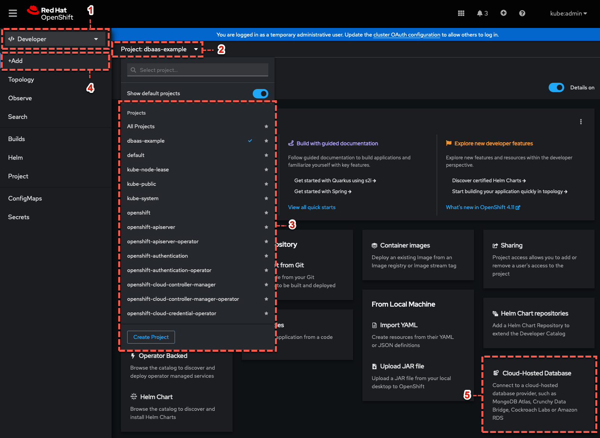
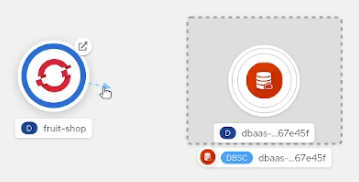
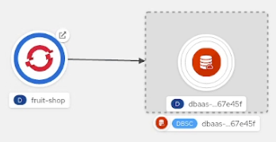
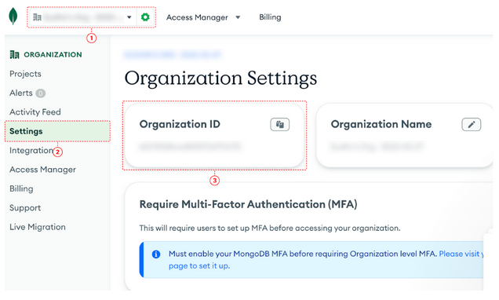
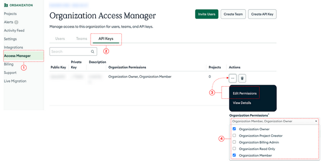
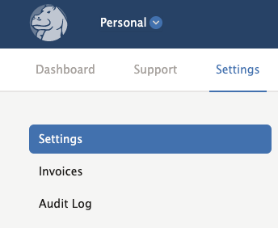
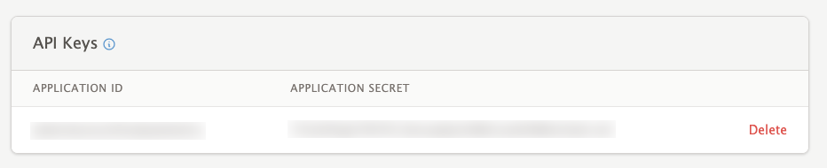
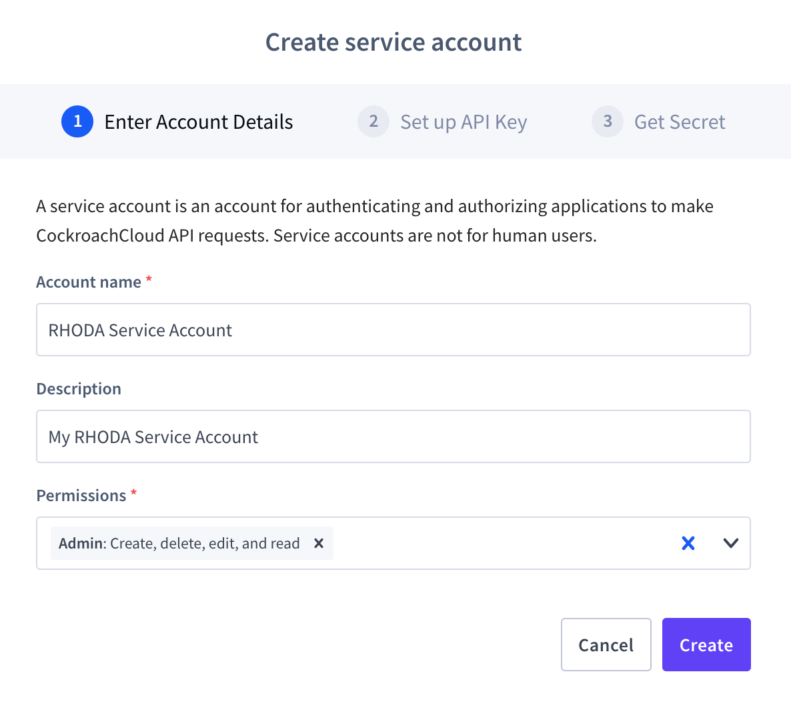
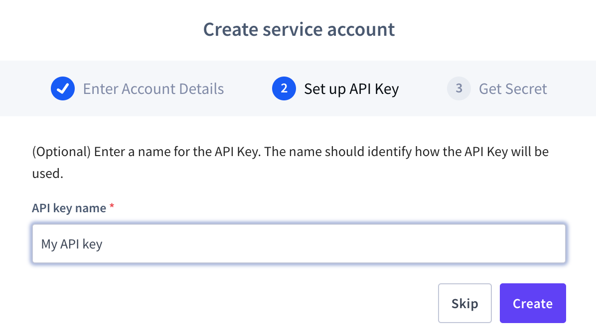
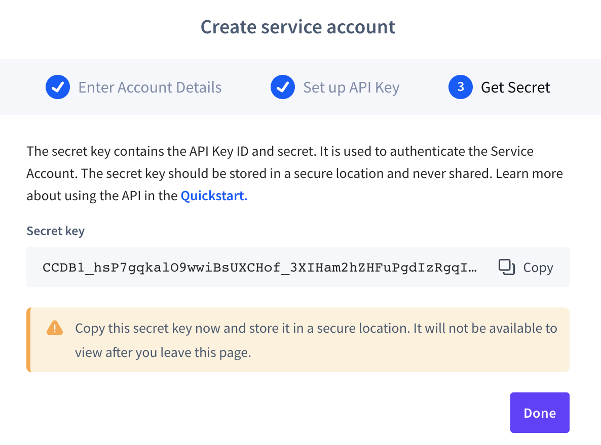

// The main assembly file for the OpenShift Database Access Quick Start Guide.

ifdef::env-github[]
:tip-caption: :bulb:
:note-caption: :information_source:
:important-caption: :heavy_exclamation_mark:
:caution-caption: :fire:
:warning-caption: :warning:
endif::[]

// Configuring the Table of Contents.
:toc:
:toclevels: 3
:toc-placement!:

// Book Title
= Quick Start Guide

This Quick Start Guide helps administrators and developers with installing, and accessing the OpenShift Database Access service.
The OpenShift Database Access operator enables you to do the following:

* Easy consumption of database-as-a-service (DBaaS) offerings from partners including MongoDB Atlas, Crunchy Bridge, CockroachDB, and Amazon's Relational Database Services (RDS) directly from managed OpenShift clusters.
* Easy management, monitoring, and control by administrators of cloud-hosted DBaaS including consumption, usage, and status.

toc::[]

// Chapter 1
[id="installing-the-openshift-database-access-operator"]

== Installing the OpenShift Database Access operator

The OpenShift Database Access operator allows you to configure a connection to cloud-database providers, create new database instances, and connect database instances to applications for developers to use.

.Prerequisites

* OpenShift Container Platform 4.10 or higher, and on these deployment types:
** OpenShift Dedicated
** OpenShift on Amazon Web Services (AWS)

.Procedure

. From the OpenShift console home page, expand the **Operators** menu, and click **OperatorHub**.

. On the **OperatorHub** page, type **dbaas** in the filter field to find the OpenShift Database Access operator.

. Click on the OpenShift Database Access operator tile, and click the **Install** button.

. On the **Install Operator** page, review the install strategy, and click the **Install* button.

. After the installation process completes, an alert message tells you the status of the installation.
If successful, an alert message asks you refresh the OpenShift web console to the latest version.
After the web console refresh, you have a new **Data Services** category on the navigational menu.
If failure, a message displays the installation error to help you investigate the problem.

.Additional resources

* For more information about OpenShift Database Access, see the _Reference Guide_.
// End

// Chapter 2
[id="accessing-the-database-access-menu-for-configuring-and-monitoring"]

== Accessing the Database Access menu for configuring and monitoring

From the OpenShift console, you can access the OpenShift Database Access navigation menu.
On the Database Access page, use the appropriate project namespace for importing a cloud-database provider account.

[IMPORTANT]
====
By using MongoDB Atlas as a cloud-database provider, you must add the IP address of the application pod to MongoDB Atlas' **IP Access List**.
If the IP address is not in the **IP Access List**, then a `504 gateway timeout error` occurs.
Visit the MongoDB Atlas link:https://docs.atlas.mongodb.com/security/ip-access-list/[website] for more details on adding an IP address to your database project.
====

[NOTE]
====
After creating a _DBaaSPolicy_ as a non-administrative user, on the *Operator details* page, under the *Provider Account Policy* section, you will see a restricted access message.
By selecting *Current namespace only* option, you can view the policies.
====

.Prerequisites

* xref:installing-the-openshift-database-access-operator[Installation] of the OpenShift Database Access operator.
* A service account with either the link:https://www.mongodb.com/atlas/database[MongoDB Atlas], or link:https://www.crunchydata.com[Crunchy Data Bridge], or link:https://www.cockroachlabs.com[CockroachDB], or link:https://portal.aws.amazon.com/billing/signup?nc2=h_ct&src=header_signup&redirect_url=https%3A%2F%2Faws.amazon.com%2Fregistration-confirmation#/start/email[Amazon RDS] cloud-hosted database provider.

.Procedure

. Log into the OpenShift console.

. Use the correct project namespace by following these sub-steps:
+
image::../images/rhoda_admin_entry_point_single_page_all_steps.png[Single page screenshot of the administrator's entry point]

.. Select the **Administrator** perspective image:../images/1st_Callout_Bullet.png[First callout].

.. Expand the **Data Services** navigation menu, and click **Database Access** image:../images/2nd_Callout_Bullet.png[Second callout].
+
NOTE: You might need to scroll down the navigation menu.

.. Click the **Project** dropdown menu and then enable the **Show default projects** switch image:../images/3rd_Callout_Bullet.png[Third callout].

.. Type **dbaas** in the search field.

.. Select **openshift-dbaas-operator** project namespace image:../images/4th_Callout_Bullet.png[Fourth callout].

. From the database inventory page you get a snapshot of the database environment.
You can import a cloud-hosted database provider account, and create a new database instance by clicking the **Configuration** menu.
+
image::../images/rhoda_admin_entry_point_inventory_page.png[Database inventory landing page]

.Additional Resources

* For more information about OpenShift Database Access, see the _Reference Guide_.
// End

// Chapter 3
[id="accessing-the-developer-workspace-and-adding-a-database-instance"]

== Accessing the developer workspace and adding a database instance

You can access the developer workspace in the OpenShift console to manage connectivity for database instances to applications.

.Prerequisites

* xref:installing-the-openshift-database-access-operator[Installation] of the OpenShift Database Access operator.
* Import at least one cloud-database provider account.

.Procedure

. Log into the OpenShift console.

. Access the developer workspace to select an existing project or create a new project, and choose a cloud-hosted database provider to add to your project:
+

.. Select the **Developer** perspective image:../images/1st_Callout_Bullet.png[First callout].

.. Click the **Project** dropdown menu image:../images/2nd_Callout_Bullet.png[Second callout].

.. Create a new project or search for your application’s project image:3rd_Callout_Bullet.png[Third callout].

.. Click **+Add** image:../images/4th_Callout_Bullet.png[Fourth callout].

.. Click the **Cloud-Hosted Databases** tile to connect to a cloud-database provider .

. Click on your cloud-hosted database provider's tile.

. Select a previously configured **Provider Account** for this database instance from the dropdown menu.

. Select the database instance ID you want to use, and click **Add to Topology**.

. Click **Continue**.
Upon a successful connection, you go to the xref:connecting-an-application-to-a-database-instance-using-the-topology-view[**Topology**] page.

.Additional resources

* For more information about OpenShift Database Access, see the _Reference Guide_.
// End

// Chapter 4
[id="connecting-an-application-to-a-database-instance-using-the-topology-view"]

== Connecting an application to a database instance using the topology view

You can add a database to an application by making a connection to the database instance from the cloud-database provider.
On the **Topology** page, you see the application pod, along with a representation of the connection of the database instance.

.Prerequisites

* xref:installing-the-openshift-database-access-operator[Installation] of the OpenShift Database Access operator.
* Import at least one cloud-database provider account.

.Procedure

. When hovering the cursor over the deployment node, you can drag the arrow from the application to the new database instance to create a binding connector.
You can also right-click on the deployment node, and click **Create Service Binding** to create a binding connector.
+

. On the pop-up dialog, click **Create**.
Once the binding is created, the application pod restarts.
After the application pod restarts, your application now has database connectivity.
+

+
This binding visually represents the injection of database connection information and credentials into the application pod.

. Use a service binding library based on your application's framework to consume the service binding information and credentials.

.Additional Resources

* See the OpenShift Database Access _Reference Guide_ for more details on service bindings, and for working application examples by using the service binding libraries.
// End

// Appendices - Helping customers find their DBaaS provider account credentials.
// Appendix A : MongoDB Atlas
[appendix]
[id="find-your-mongodb-atlas-account-credentials"]

== Find your MongoDB Atlas account credentials

You need the Organization ID, the Organization Public Key, and the Organization Private Key to create a provider account resource for MongoDB Atlas.

[IMPORTANT]
====
If using MongoDB Atlas as a cloud-database provider, then you must add the IP address of the application pod to MongoDB Atlas' IP Access List.
If the IP address is not in the IP Access List, then a 504 gateway timeout error occurs.
Visit the MongoDB Atlas link:https://docs.atlas.mongodb.com/security/ip-access-list/[website] for more details on adding an IP address to your database project.
====

.Procedure

. From the MongoDB Atlas link:https://www.mongodb.com/[home page], **Sign In** to your account.

. From your account home page:
+

.. Select **Organization** from the dropdown menu image:../images/1st_Callout_Bullet.png[First callout].

.. Click **Settings** from the Organization navigation menu image:../images/2nd_Callout_Bullet.png[Second callout].

.. Copy the Organization ID value image:../images/3rd_Callout_Bullet.png[Third callout].
+
NOTE: In some cases your organization ID may be hidden by default.

. Next, from the account home page:
+

.. Click **Access Manager** from the **Organization** navigation menu image:../images/1st_Callout_Bullet.png[First callout].

.. Click **API Keys** image:../images/2nd_Callout_Bullet.png[Second callout].

.. If you have existing API keys, you can find them listed here.
Copy the API public and private keys for the import provider account fields.
Also, verify that your API keys have the **Organization Owner** and **Organization Member** permissions image:../images/3rd_Callout_Bullet.png[Third callout] image:../images/4th_Callout_Bullet.png[Fourth callout].

. If you need new API keys, click **Create API Key**, and proceed to the next step.

. On the **Create API Key** page, enter a **Description**, and under the **Organization Permissions** dropdown box select the **Organization Owner** and **Organization Member** permissions.
Click **Next**.

. Copy the API public and private keys for the import provider account fields.
// End

// Appendix B : Crunchy Data Bridge
[appendix]
[id="find-your-crunchy-data-bridge-account-credentials"]

== Find your Crunchy Data Bridge account credentials

You need the Public API Key, and the Private API Secret to create a provider account resource for Crunchy Data Bridge.

.Procedure

. From the Crunch Data Bridge link:https://www.crunchybridge.com/account[Log in page], sign in to your account.

. From your personal account home page, click **Settings**, and then click **Settings** from the navigation menu.
+

. Copy the **Application ID** and **Application Secret** values for the import provider account fields.
+

// End

// Appendix C : CockroachDB
[appendix]
[id="find-your-cockroachdb-account-credentials"]

== Find your CockroachDB account credentials

You need the API Key to create a provider account resource for CockroachDB.

[IMPORTANT]
====
Currently, access to the **Service Accounts** tab on the **Access Management** page is enabled by invite only from CockroachDB.
To expose the **Service Accounts** tab on the **Access Management** page, you can request that this feature be enabled.
Contact link:https://support.cockroachlabs.com/hc/en-us[CockroachDB support] and ask for the Cloud API to be enabled in the CockroachDB Cloud Console for your user account.

Additionally, you can view this link:https://youtu.be/5Xkf7tMbbxM[quick video tutorial] from Cockroach Labs on creating an account.
====

.Procedure

. From the CockroachDB link:https://cockroachlabs.cloud/service-accounts/[service account page], log in to your account.

. From your service account home page, select **Access** from the navigation menu.

. Click **Service Accounts** from the **Access Management** page.

. Click **Create Service Account**.

. Enter an **Account name**, select the **Permissions**, and click **Create**.
+

. Enter an **API key name**, and click **Create**.
+

. Copy the **Secret key** for the import provider account field, and click **Done**.
+

// End

// Appendix D : Amazon RDS
[appendix]
[id="find-your-amazon-rds-account-credentials"]

== Find your Amazon RDS account credentials

You need an Amazon Web Services (**AWS**) **Access key ID**, an **AWS Secret access key**, and know which **AWS Region** you are using to import an Amazon Relational Database Service (RDS) provider account for OpenShift Database Access.
If you lose your AWS Access key ID, and your AWS Secret access key, new ones must be created.

[NOTE]
====
Amazon only allows two secret access keys for each user.
You might need to deactivate unused keys, or delete lost keys before you can create a new access key.
====

[IMPORTANT]
====
You are limited to one Amazon RDS provider account per OpenShift cluster.
Using your AWS credentials on more than one OpenShift cluster breaks established connections on all OpenShift clusters, except for the last OpenShift cluster that established a connection.
====

IMPORTANT: OpenShift Database Access only supports RDS database **instance deployments**, and does not support database **cluster deployments**.

IMPORTANT: Database instances using a custom Oracle or custom SQL Server engine type are not supported.

.Prerequisites

* An Amazon Web Services link:https://portal.aws.amazon.com/billing/signup?nc2=h_ct&src=header_signup&redirect_url=https%3A%2F%2Faws.amazon.com%2Fregistration-confirmation#/start/email[(AWS) account name].

.Procedure

. Sign in to Amazon’s Identity and Access Management link:https://console.aws.amazon.com/[(IAM) console] with your AWS user account.

. From the IAM console home page, expand the **Access management** menu, and click **Users**.

. Select a user from the list.

. On the user’s summary page, select the **Security credentials** tab, and click the **Create access key** button.

. Copy the **AWS Access key ID**, and the **AWS Secret access key**.
// End

// Appendix E : Manual installation using Operator Lifecycle Manager (OLM)
[appendix]
[id="installing-openshift-database-access-using-the-operator-lifecycle-manager"]

== Installing OpenShift Database Access using the Operator Lifecycle Manager

For some OpenShift cluster types, you must install the OpenShift Database Access operator by using the Operator Lifecycle Manager (OLM).

.Prerequisites

* OpenShift Container Platform 4.10 or higher.
* A running OpenShift Dedicated or ARO cluster.

.Procedure

. Log into OpenShift by using the a command-line interface:
+
.Syntax
[source,subs="verbatim,quotes"]
----
oc login --token=_TOKEN_ --server=_SERVER_URL_AND_PORT_
----
+
.Example
----
$ oc login --token=sha256~ZvFDBvoIYAbVECixS4-WmkN4RfnNd8Neh3y1WuiFPXC --server=https://example.com:6443
----
+
[NOTE]
====
You can find your command-line login token and URL from the OpenShift console.
Log in to the OpenShift console.
Click your user name, and click **Copy login command**.
Offer your user name and password again, and click **Display Token** to view the command.
====

. Create an OpenShift Database Access catalog source using the latest add-on image repository:
+
.Example
----
$ cat <<EOF | oc apply -f -
apiVersion: operators.coreos.com/v1alpha1
kind: CatalogSource
metadata:
  name: dbaas-operator
  namespace: openshift-marketplace
spec:
  sourceType: grpc
  image: quay.io/osd-addons/dbaas-operator-index@sha256:2788a47fd0ef1ece30898c1e608050ea71036d3329b9772dbb3d1f69313f745c
  displayName: DBaaS Operator
EOF
----

. Verify the catalog source is added, and in a ready state:
+
.Example
----
$ oc get catalogsource dbaas-operator \
-n openshift-marketplace \
-o jsonpath='{.status.connectionState.lastObservedState} {"\n"}'
----
+
IMPORTANT: Wait until the catalog source is in a `READY` state, before proceeding to the next step.

. Login to the OpenShift console with a user that has administrative privileges.

. In the **Administrator** perspective, expand the **Operators** navigation menu, and click **OperatorHub**.

. In the filter field, type **database access**, and click the **OpenShift Database Access Operator** tile.

. Click the **Install** button to show the operator details.

. The default and recommended namespace for the OpenShift Database Access operator is **openshift-dbaas-operator**, click **Install** on the **Install Operator** page.
+
NOTE: All dependencies are automatically installed, this includes the provider account operators, and the quick-start guides.

.Verification

. Once the OpenShift Database Access operator successfully installs, a new navigation menu item is added, called **Data Services**.
Expand the **Data Services** menu.
This might take a few minutes to refresh the navigation menu.

. Click **Database Access**.

. On the **Database Access** home page you see an empty inventory table.
+
image::../images/rhoda_admin_entry_point_inventory_page.png[Database inventory landing page]

.Additional resources

* For additional information about OpenShift Database Access, see the _Reference Guide_.
// End
