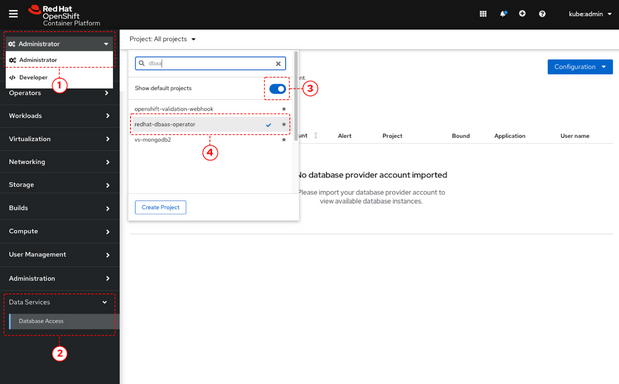
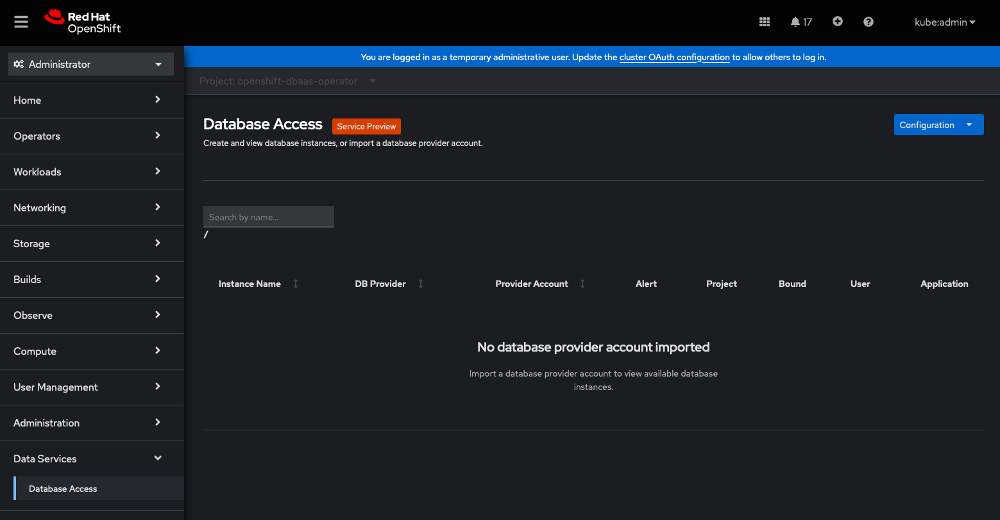

:_module-type: PROCEDURE

[id="accessing-the-database-access-menu-for-configuring-and-monitoring_{context}"]

= Accessing the Database Access menu for configuring and monitoring

[role="_abstract"]
From the OpenShift console, you can access the OpenShift Database Access navigation menu.
On the Database Access page, use the appropriate project namespace for importing a cloud-database provider account.

[IMPORTANT]
====
By using MongoDB Atlas as a cloud-database provider, you must add the IP address of the application pod to MongoDB Atlas' **IP Access List**.
If the IP address is not in the **IP Access List**, then a `504 gateway timeout error` occurs.
Visit the MongoDB Atlas link:https://docs.atlas.mongodb.com/security/ip-access-list/[website] for more details on adding an IP address to your database project.
====

[NOTE]
====
After creating a _DBaaSPolicy_ as a non-administrative user, on the *Operator details* page, under the *Provider Account Policy* section, you will see a restricted access message.
By selecting *Current namespace only* option, you can view the policies.
====

.Prerequisites

* xref:installing-the-red-hat-openshift-database-access-add-on_{context}[Installation] of the OpenShift Database Access add-on.
* A service account with either the link:https://www.mongodb.com/atlas/database[MongoDB Atlas], or link:https://www.crunchydata.com[Crunchy Data Bridge], or link:https://www.cockroachlabs.com[CockroachDB], or link:https://portal.aws.amazon.com/billing/signup?nc2=h_ct&src=header_signup&redirect_url=https%3A%2F%2Faws.amazon.com%2Fregistration-confirmation#/start/email[Amazon RDS] cloud-hosted database provider.

.Procedure

. Log into the OpenShift console.

. Use the correct project namespace by following these sub-steps:
+

.. Select the **Administrator** perspective .

.. Expand the **Data Services** navigation menu, and click **Database Access** image:../../images/2nd_Callout_Bullet.png[Second callout].
+
NOTE: You might need to scroll down the navigation menu.

.. Click the **Project** dropdown menu and then enable the **Show default projects** switch .

.. Type **dbaas** in the search field.

.. Select **redhat-dbaas-operator** or **openshift-dbaas-operator** project namespace .

. From the database inventory page you get a snapshot of the database environment.
You can import a cloud-hosted database provider account, and create a new database instance by clicking the **Configuration** menu.
+

[role="_additional-resources"]
.Additional Resources

* For more information about Red Hat OpenShift Database Access, see the link:https://access.redhat.com/documentation/en-us/red_hat_openshift_database_access/2022-q4/html-single/reference_guide/index[_Reference Guide_].

////
More links:
* See link:{rhoda-prod-doc-url}#finding-your-cloud-database-provider-account-credentials[_Appendix A_] in the _Red Hat OpenShift Database Access Quick Start Guide_ for help in finding your provider account information.
* The MongoDB Atlas link:https://www.mongodb.com/cloud/atlas[home page].
* The Crunchy Data Bridge link:https://www.crunchydata.com[home page].
* The CockroachDB link:https://www.cockroachlabs.com[home page].
////
